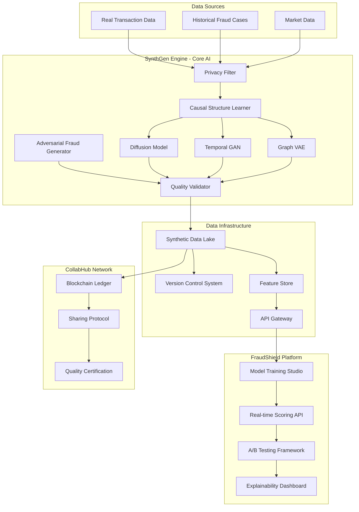

# Synthetic Transaction Intelligence Network (STIN)

[](https://opensource.org/licenses/MIT)
[](https://www.python.org/downloads/)
[](https://nodejs.org/)

> AI-powered platform for generating privacy-preserving synthetic financial transaction data to revolutionize fraud detection and risk management.

## 🎯 Project Overview

STIN is a comprehensive platform that generates synthetic financial transaction data that is statistically indistinguishable from real data but contains zero actual customer information. This enables financial institutions to:

- Train better fraud detection models without privacy concerns
- Collaborate and share fraud intelligence through synthetic data
- Perform stress testing and scenario analysis at 90% lower cost
- Achieve regulatory compliance through privacy-preserving AI

### Core Products

1. **SynthGen Engine** - AI core that generates synthetic transactions using advanced generative models
2. **FraudShield Platform** - Fraud detection training and deployment system powered by synthetic data
3. **CollabHub** - Secure cross-institution data sharing network with blockchain-based provenance

## 🏗️ Architecture



## 👥 Team Structure

This project is organized for collaboration between four team members:

| Team Member | Role | Primary Responsibility | Directory |
|-------------|------|----------------------|-----------|
| **Member 1** | ML/AI Specialist | AI model development, privacy validation | [`synthgen-engine/`](synthgen-engine/) |
| **Member 2** | Data Engineer/MLOps | Infrastructure, pipelines, deployment | [`data-infrastructure/`](data-infrastructure/) |
| **Member 3** | Full-Stack Developer | Applications, APIs, user interfaces | [`fraudshield-platform/`](fraudshield-platform/) |
| **Member 4** | Strategy/Compliance Lead | Governance, ethics, regulatory compliance | [`governance-ethics/`](governance-ethics/) |

## 🚀 Quick Start

### Prerequisites

- **Python**: 3.10 or higher
- **Node.js**: 18 or higher
- **Docker**: 20.10 or higher
- **Git**: 2.30 or higher
- **GPU**: NVIDIA GPU with CUDA 11.8+ (for ML training)

### Initial Setup

1. **Clone the repository**
   ```bash
   git clone https://github.com/your-org/stin.git
   cd stin
   ```

2. **Set up environment variables**
   ```bash
   cp .env.example .env
   # Edit .env with your configuration
   ```

3. **Install dependencies**
   ```bash
   # Install all components
   make install
   
   # Or install individually
   make install-ml        # ML components
   make install-infra     # Infrastructure
   make install-app       # Applications
   ```

4. **Start local development environment**
   ```bash
   docker-compose up -d
   ```

5. **Run tests**
   ```bash
   make test
   ```

### Component-Specific Setup

#### SynthGen Engine (ML/AI)
```bash
cd synthgen-engine
pip install -r requirements.txt
python -m pytest tests/
```

#### Data Infrastructure
```bash
cd data-infrastructure
pip install -r requirements.txt
terraform init infrastructure/terraform/
```

#### FraudShield Platform
```bash
# Backend
cd fraudshield-platform/backend
pip install -r requirements.txt

# Frontend
cd fraudshield-platform/frontend/training-studio
npm install
npm run dev
```

#### Governance & Ethics
```bash
cd governance-ethics
# Review documentation and templates
```

## 📁 Project Structure

```
stin/
├── synthgen-engine/          # Task 1: AI Model Development
├── data-infrastructure/      # Task 2: Data Infrastructure & MLOps
├── fraudshield-platform/     # Task 3: Application Development
├── governance-ethics/        # Task 4: Governance & Compliance
├── collabhub-network/        # Cross-institution collaboration
├── shared/                   # Shared resources
├── docs/                     # Documentation
├── scripts/                  # Utility scripts
└── tests/                    # Integration tests
```

See [`FolderStructure.md`](FolderStructure.md) for detailed directory structure.

## 🔄 Development Workflow

### Branch Strategy

```
main                    # Production-ready code
├── develop            # Integration branch
│   ├── feature/ml-*   # ML model features (Team Member 1)
│   ├── feature/infra-* # Infrastructure features (Team Member 2)
│   ├── feature/app-*  # Application features (Team Member 3)
│   └── feature/gov-*  # Governance features (Team Member 4)
├── release/*          # Release branches
└── hotfix/*           # Hotfix branches
```

### Workflow Steps

1. **Create a feature branch**
   ```bash
   git checkout develop
   git pull origin develop
   git checkout -b feature/[area]-[description]
   ```

2. **Make changes and commit**
   ```bash
   git add .
   git commit -m "feat: add description of changes"
   ```

3. **Push and create pull request**
   ```bash
   git push origin feature/[area]-[description]
   # Create PR on GitHub targeting develop branch
   ```

4. **Code review and merge**
   - At least one approval required
   - All CI checks must pass
   - Squash and merge into develop

### Commit Message Convention

Follow [Conventional Commits](https://www.conventionalcommits.org/):

- `feat:` - New feature
- `fix:` - Bug fix
- `docs:` - Documentation changes
- `style:` - Code style changes (formatting, etc.)
- `refactor:` - Code refactoring
- `test:` - Adding or updating tests
- `chore:` - Maintenance tasks

Examples:
```
feat(ml): implement diffusion model for transaction generation
fix(api): resolve timeout issue in scoring endpoint
docs(readme): update installation instructions
test(infra): add integration tests for data pipeline
```

## 🧪 Testing

### Running Tests

```bash
# Run all tests
make test

# Run specific component tests
make test-ml          # ML models
make test-infra       # Infrastructure
make test-app         # Applications
make test-integration # Integration tests

# Run with coverage
make test-coverage
```

### Test Requirements

- **Unit tests**: 90% coverage minimum
- **Integration tests**: All cross-component interactions
- **E2E tests**: Critical user workflows
- **Performance tests**: Load and stress testing

## 📊 Project Timeline

**Total Duration**: 16 weeks

### Phase 1: Foundation (Weeks 1-4)
- ML model architecture setup
- Infrastructure foundation
- Basic UI components
- Governance framework

### Phase 2: Core Development (Weeks 5-10)
- Model training and optimization
- Data pipelines and APIs
- Application features
- Compliance documentation

### Phase 3: Integration (Weeks 11-14)
- Cross-component integration
- End-to-end testing
- Performance optimization
- Security hardening

### Phase 4: Launch Preparation (Weeks 15-16)
- Final testing and validation
- Documentation completion
- Deployment preparation
- Stakeholder demos

## 📈 Success Metrics

### Technical Metrics
- **Privacy**: ε < 1.0 (differential privacy), k ≥ 5 (k-anonymity)
- **Fidelity**: 95% statistical test pass rate, JS divergence < 0.1
- **Performance**: 10,000 transactions/second generation, <50ms scoring latency
- **Accuracy**: >95% fraud detection rate, <2% false positive rate

### Business Metrics
- 40% reduction in fraud losses
- 50% reduction in manual review workload
- 90% cost reduction for stress testing
- <1 day time to deploy new models

## 🔒 Security & Privacy

### Privacy Guarantees
- Differential privacy with ε < 1.0
- k-anonymity with k ≥ 5
- Zero actual customer data in synthetic output
- Membership inference attack resistance

### Security Measures
- End-to-end encryption for data in transit
- Role-based access control (RBAC)
- Audit logging for all operations
- Regular security scanning and penetration testing

## 📚 Documentation

- **[Architecture Documentation](docs/architecture/)** - System design and architecture
- **[API Documentation](docs/api/)** - API specifications and examples
- **[User Guides](docs/user-guides/)** - End-user documentation
- **[Development Guides](docs/development/)** - Developer documentation
- **[Compliance Documentation](docs/compliance/)** - Regulatory and compliance docs

## 🤝 Contributing

We welcome contributions! Please see [`CONTRIBUTING.md`](CONTRIBUTING.md) for details on:

- Code of conduct
- Development setup
- Coding standards
- Pull request process
- Issue reporting

### Getting Help

- **Slack**: #stin-project
- **Email**: stin-team@example.com
- **Issues**: [GitHub Issues](https://github.com/your-org/stin/issues)
- **Wiki**: [Project Wiki](https://github.com/your-org/stin/wiki)

## 📋 Project Management

### Tools
- **Project Board**: [GitHub Projects](https://github.com/your-org/stin/projects)
- **Documentation**: [Confluence/Notion]
- **Communication**: Slack
- **CI/CD**: GitHub Actions

### Weekly Sync
- **When**: Every Monday, 10:00 AM
- **Duration**: 1 hour
- **Agenda**: Progress updates, blockers, planning

### Sprint Planning
- **Duration**: 2-week sprints
- **Planning**: First Monday of sprint
- **Review**: Last Friday of sprint
- **Retrospective**: After sprint review

## 🎯 Milestones

### Week 4: Foundation Complete
- [ ] ML model architectures implemented
- [ ] Infrastructure foundation deployed
- [ ] Basic UI prototypes
- [ ] Governance framework established

### Week 8: Core Features Complete
- [ ] Models trained and validated
- [ ] Data pipelines operational
- [ ] Key application features working
- [ ] Compliance documentation drafted

### Week 12: Integration Complete
- [ ] All components integrated
- [ ] End-to-end workflows functional
- [ ] Performance targets met
- [ ] Security audit passed

### Week 16: Launch Ready
- [ ] All tests passing
- [ ] Documentation complete
- [ ] Deployment automated
- [ ] Stakeholder approval obtained

## 🐛 Known Issues

Track known issues in [GitHub Issues](https://github.com/your-org/stin/issues) with the `bug` label.

## 📝 License

This project is licensed under the MIT License - see the [`LICENSE`](LICENSE) file for details.

## 🙏 Acknowledgments

- Financial institutions providing anonymized data for research
- Open-source ML frameworks (PyTorch, TensorFlow)
- Cloud infrastructure providers
- Academic research community

## 📞 Contact

- **Project Lead**: [Name] - lead@example.com
- **ML Lead**: [Name] - ml@example.com
- **Infrastructure Lead**: [Name] - infra@example.com
- **Application Lead**: [Name] - app@example.com
- **Compliance Lead**: [Name] - compliance@example.com

---

**Built with ❤️ by the STIN Team**

Last Updated: 2026-05-21