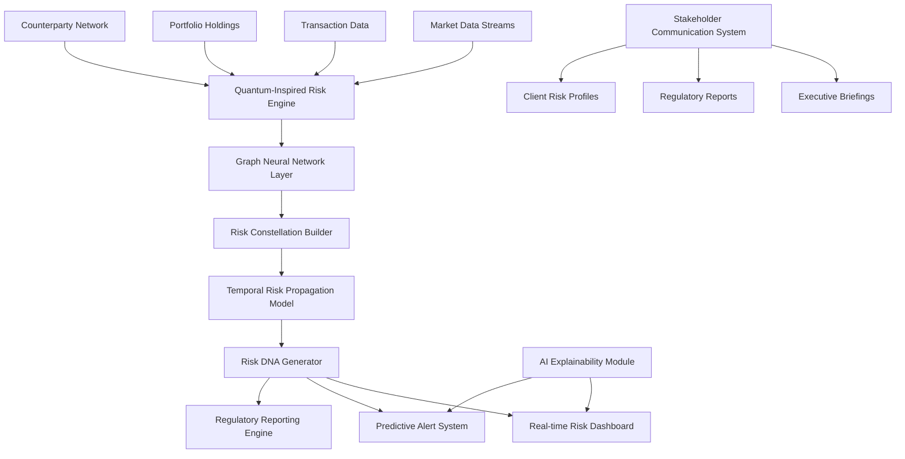
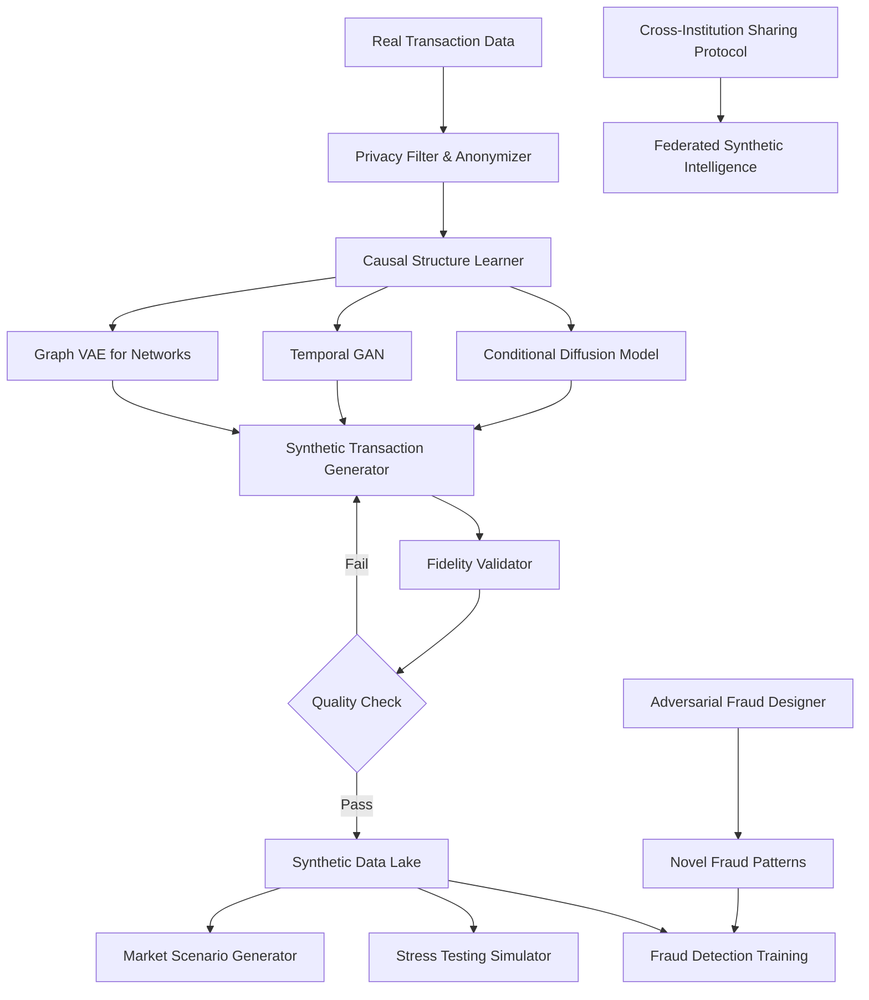
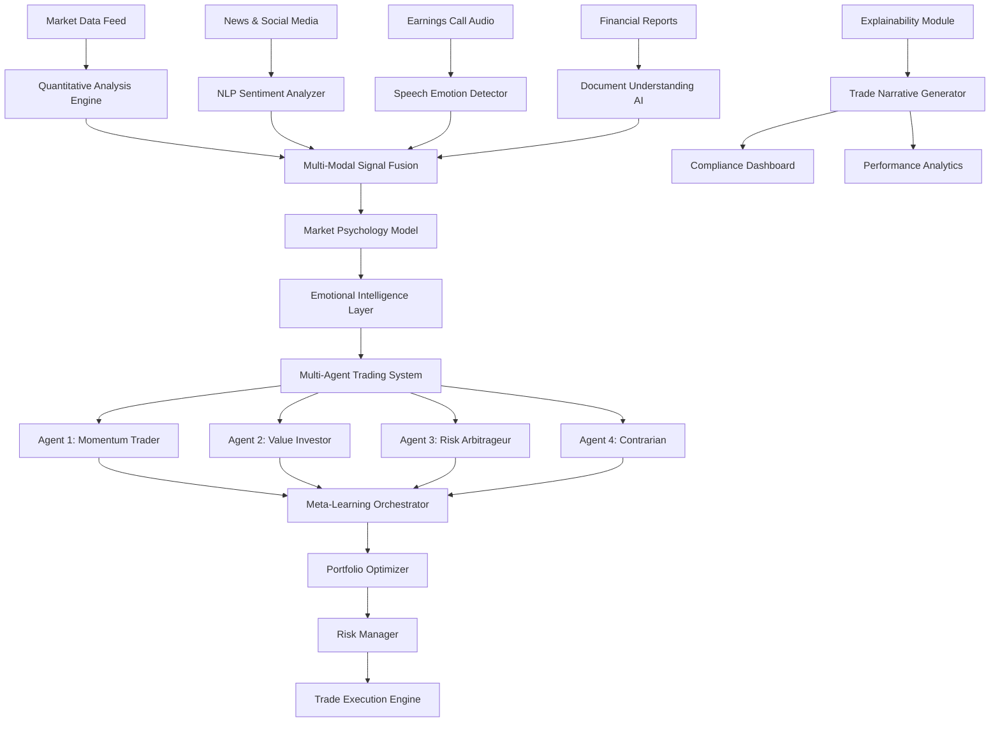

# Enterprise AI Transformation Project Plans
## Financial Services Industry Focus

---

## Project 1: Quantum-Inspired AI Risk Constellation System

### Overview
A revolutionary multi-dimensional risk assessment platform that uses quantum-inspired algorithms and graph neural networks to model interconnected financial risks across portfolios, counterparties, and market conditions in real-time. Unlike traditional risk models that analyze risks in isolation, this system creates a "risk constellation" - a living, breathing network that shows how risks propagate, amplify, or cancel each other out across the entire enterprise.

### Innovation Factor
- **Never-before-seen approach**: Combines quantum annealing simulation with graph neural networks to solve the NP-hard problem of multi-dimensional risk correlation
- **Real-time risk DNA**: Creates unique "risk fingerprints" for every transaction, portfolio, and entity
- **Predictive risk cascades**: Identifies potential domino effects before they happen using temporal graph attention networks
- **Explainable quantum decisions**: Translates complex quantum-inspired computations into human-understandable risk narratives

### Architecture Diagram

### Task Breakdown

#### Task 1 (Technical - Data Science/ML): Quantum-Inspired Risk Engine & Graph Neural Networks
**Complexity: High**

Build the core AI engine that powers the risk constellation system:

- Implement quantum-inspired optimization algorithms (QAOA-style) for portfolio risk optimization
- Design and train custom Graph Attention Networks (GAT) for modeling risk propagation across counterparty networks
- Create temporal graph neural networks to predict risk cascade patterns
- Develop the "Risk DNA" algorithm that generates unique risk signatures for entities
- Build real-time inference pipeline capable of processing 100K+ risk calculations per second
- Implement federated learning framework for privacy-preserving risk model training across institutions

**Deliverables:**
- Quantum-inspired risk optimization engine (Python/PyTorch)
- Custom GAT models for risk propagation
- Risk DNA generation algorithm
- Real-time inference API
- Model training pipeline with MLOps integration

#### Task 2 (Technical - Backend/Infrastructure): Distributed Risk Processing Platform
**Complexity: High**

Build the scalable infrastructure that ingests, processes, and serves risk data:

- Design event-driven microservices architecture for real-time data ingestion from multiple sources
- Implement distributed graph database (Neo4j/TigerGraph) for storing risk constellation networks
- Build streaming data pipeline using Apache Kafka/Flink for real-time risk updates
- Create API gateway with GraphQL for flexible risk data queries
- Implement caching layer (Redis) for sub-millisecond risk lookups
- Design disaster recovery and data consistency mechanisms
- Build monitoring and observability stack (Prometheus/Grafana)

**Deliverables:**
- Microservices architecture (Go/Rust for performance-critical services)
- Graph database schema and optimization
- Real-time streaming pipeline
- GraphQL API layer
- Infrastructure-as-code (Terraform/Kubernetes)

#### Task 3 (Technical - Frontend/Visualization): Interactive Risk Constellation Interface
**Complexity: High**

Create an immersive, interactive visualization platform for exploring risk networks:

- Build 3D force-directed graph visualization of risk constellations using WebGL (Three.js/D3.js)
- Implement interactive risk exploration with zoom, filter, and time-travel capabilities
- Create real-time risk heatmaps and flow animations showing risk propagation
- Design AI-powered natural language query interface for risk questions
- Build customizable dashboard with drag-and-drop widgets
- Implement collaborative features for team risk analysis sessions
- Create mobile-responsive views for executive access

**Deliverables:**
- React/Next.js web application
- 3D risk visualization engine
- Natural language query interface
- Real-time dashboard with WebSocket updates
- Mobile-responsive design

#### Task 4 (Non-Technical - Strategy/Communication): Risk Narrative & Stakeholder Engagement
**Complexity: Medium-High**

Develop the strategic framework and communication materials for enterprise adoption:

- Create comprehensive risk taxonomy and glossary for the new system
- Design stakeholder communication strategy (executives, risk managers, regulators, clients)
- Develop training materials and certification program for risk analysts
- Write regulatory compliance documentation and audit trails
- Create executive briefing templates with AI-generated risk narratives
- Design change management plan for enterprise rollout
- Develop case studies and ROI models for different risk scenarios
- Create marketing materials demonstrating competitive advantage

**Deliverables:**
- Risk taxonomy documentation
- Stakeholder communication playbook
- Training curriculum and materials
- Regulatory compliance documentation
- Executive briefing templates
- Change management roadmap
- ROI analysis framework

### Expected Impact
- 60% reduction in risk assessment time
- 40% improvement in risk prediction accuracy
- Real-time identification of systemic risk patterns
- Regulatory compliance automation
- Competitive advantage through superior risk intelligence

---

## Project 2: Synthetic Transaction Intelligence Network (STIN)

### Overview
An AI system that generates synthetic but realistic financial transaction data to train fraud detection models, stress-test systems, and simulate market scenarios - while maintaining perfect privacy compliance. The system uses advanced GANs, diffusion models, and causal inference to create "digital twins" of transaction patterns that are statistically indistinguishable from real data but contain zero actual customer information. This enables financial institutions to share intelligence, collaborate on fraud detection, and build better models without privacy concerns.

### Innovation Factor
- **Privacy-first AI collaboration**: Enables competing banks to share fraud intelligence through synthetic data
- **Causal transaction synthesis**: Generates transactions that maintain causal relationships and business logic
- **Adversarial fraud simulation**: Creates novel fraud patterns that don't exist yet to train proactive detection
- **Regulatory sandbox**: Allows testing of new financial products in synthetic environments before real deployment

### Architecture Diagram

### Task Breakdown

#### Task 1 (Technical - ML/Generative AI): Synthetic Data Generation Engine
**Complexity: Very High**

Build the core generative AI models for creating synthetic financial transactions:

- Implement conditional diffusion models for transaction generation with controllable attributes
- Design temporal GANs that maintain time-series coherence and seasonality
- Build graph VAE for generating realistic counterparty networks
- Create causal structure learning algorithm to preserve business logic
- Develop adversarial fraud pattern generator using reinforcement learning
- Implement privacy metrics (differential privacy, k-anonymity) validation
- Build fidelity assessment framework comparing synthetic vs real distributions

**Deliverables:**
- Diffusion model for transaction synthesis (PyTorch/JAX)
- Temporal GAN architecture
- Graph VAE for network generation
- Causal inference engine
- Adversarial fraud generator
- Privacy validation toolkit
- Fidelity assessment metrics

#### Task 2 (Technical - Data Engineering/MLOps): Synthetic Data Pipeline & Orchestration
**Complexity: High**

Build the infrastructure for generating, validating, and serving synthetic data at scale:

- Design data ingestion pipeline with privacy-preserving transformations
- Implement distributed training infrastructure for generative models (Ray/Kubeflow)
- Build synthetic data versioning and lineage tracking system
- Create automated quality assurance pipeline with statistical tests
- Implement API for on-demand synthetic data generation
- Design cross-institution data sharing protocol with blockchain-based provenance
- Build monitoring system for model drift and quality degradation

**Deliverables:**
- Data pipeline architecture (Apache Airflow/Prefect)
- Distributed training infrastructure
- Data versioning system (DVC/MLflow)
- Quality assurance framework
- Synthetic data API (FastAPI)
- Blockchain-based sharing protocol
- Monitoring dashboard

#### Task 3 (Technical - Application Development): Fraud Detection & Simulation Platform
**Complexity: High**

Build applications that leverage synthetic data for fraud detection and scenario testing:

- Create fraud detection model training platform using synthetic data
- Implement real-time fraud scoring API with A/B testing capabilities
- Build stress testing simulator for financial systems
- Design market scenario generator for risk assessment
- Create interactive fraud pattern explorer
- Implement model explainability dashboard showing decision factors
- Build regulatory reporting module for model validation

**Deliverables:**
- Fraud detection training platform (Python/Scikit-learn/XGBoost)
- Real-time scoring API
- Stress testing simulator
- Scenario generation engine
- Interactive web application (React/Vue.js)
- Explainability dashboard
- Regulatory reporting module

#### Task 4 (Non-Technical - Ethics/Governance): Privacy Framework & Industry Collaboration
**Complexity: High**

Establish the ethical, legal, and collaborative framework for synthetic data usage:

- Develop comprehensive privacy and ethics guidelines for synthetic data
- Create legal framework for cross-institution data sharing
- Design governance model for synthetic data quality standards
- Write regulatory compliance documentation (GDPR, CCPA, financial regulations)
- Establish industry consortium for synthetic intelligence sharing
- Create certification program for synthetic data quality
- Develop use case library and best practices guide
- Design communication strategy for customer transparency

**Deliverables:**
- Privacy and ethics framework document
- Legal agreements for data sharing
- Governance model documentation
- Regulatory compliance guide
- Industry consortium charter
- Certification standards
- Best practices playbook
- Customer communication materials

### Expected Impact
- Enable privacy-compliant AI collaboration across institutions
- 50% reduction in fraud detection model training time
- Ability to detect fraud patterns before they occur in reality
- 90% cost reduction in stress testing and scenario analysis
- New revenue streams from synthetic data services

---

## Project 3: Cognitive Trading Orchestrator with Emotional Market Intelligence

### Overview
An AI-powered algorithmic trading system that doesn't just analyze numbers - it understands market psychology, sentiment, and behavioral patterns. By combining traditional quantitative analysis with NLP-based sentiment analysis, social media monitoring, news interpretation, and even audio analysis of earnings calls, this system creates a "market emotional intelligence" layer. It uses multi-agent reinforcement learning where different AI agents represent different trading strategies and personalities, competing and collaborating to optimize portfolio performance while managing risk.

### Innovation Factor
- **Emotional market intelligence**: First system to quantify and trade on collective market psychology
- **Multi-agent trading ecosystem**: AI agents with different personalities compete and learn from each other
- **Cross-modal signal fusion**: Combines text, audio, video, and numerical data for trading decisions
- **Explainable trading narratives**: Generates human-readable explanations for every trade decision
- **Adaptive strategy evolution**: Trading strategies evolve in real-time based on market regime changes

### Architecture Diagram

### Task Breakdown

#### Task 1 (Technical - ML/NLP): Emotional Intelligence & Multi-Modal Analysis
**Complexity: Very High**

Build the AI models that extract emotional and psychological signals from diverse data sources:

- Implement transformer-based sentiment analysis for financial news and social media (FinBERT fine-tuning)
- Build speech emotion recognition model for earnings call analysis
- Create document understanding AI for financial report interpretation (LayoutLM/Donut)
- Develop market psychology model using behavioral finance theories
- Implement cross-modal fusion network combining text, audio, and numerical signals
- Build temporal attention mechanism for tracking sentiment evolution
- Create anomaly detection for unusual emotional patterns

**Deliverables:**
- Fine-tuned FinBERT models for sentiment analysis
- Speech emotion recognition system (Wav2Vec2/Whisper)
- Document understanding pipeline
- Market psychology quantification model
- Multi-modal fusion network (PyTorch)
- Temporal sentiment tracker
- Anomaly detection system

#### Task 2 (Technical - Reinforcement Learning/Trading Systems): Multi-Agent Trading Orchestrator
**Complexity: Very High**

Build the multi-agent reinforcement learning system and trading infrastructure:

- Implement multi-agent reinforcement learning framework (PPO/SAC algorithms)
- Design different agent personalities with distinct trading strategies
- Build meta-learning orchestrator that allocates capital across agents
- Create portfolio optimization engine with risk constraints
- Implement backtesting framework with realistic market simulation
- Build real-time trade execution system with smart order routing
- Design risk management system with circuit breakers and position limits

**Deliverables:**
- Multi-agent RL framework (Ray RLlib/Stable-Baselines3)
- Agent strategy implementations
- Meta-learning orchestrator
- Portfolio optimizer (cvxpy/scipy)
- Backtesting engine
- Trade execution system
- Risk management module

#### Task 3 (Technical - Data Engineering/Real-time Systems): Data Pipeline & Trading Infrastructure
**Complexity: High**

Build the real-time data infrastructure and trading platform:

- Design low-latency data ingestion from multiple sources (market data, news, social media)
- Implement real-time NLP processing pipeline for news and social media
- Build time-series database for market data (InfluxDB/TimescaleDB)
- Create feature store for ML signals (Feast/Tecton)
- Implement WebSocket-based real-time dashboard
- Build order management system with broker integrations
- Design monitoring and alerting infrastructure

**Deliverables:**
- Real-time data pipeline (Apache Kafka/Flink)
- NLP processing infrastructure
- Time-series database setup
- Feature store implementation
- Real-time dashboard (React/WebSocket)
- Order management system
- Monitoring stack (Prometheus/Grafana)

#### Task 4 (Non-Technical - Strategy/Compliance): Trading Strategy Framework & Regulatory Compliance
**Complexity: High**

Develop the strategic framework, compliance documentation, and performance analysis:

- Create comprehensive trading strategy documentation for each agent
- Design risk management policies and position limits
- Write regulatory compliance documentation (SEC, FINRA requirements)
- Develop explainability framework for trade decisions
- Create performance attribution methodology
- Design investor communication materials and reporting templates
- Build compliance monitoring procedures
- Develop disaster recovery and business continuity plans

**Deliverables:**
- Trading strategy playbook
- Risk management policy document
- Regulatory compliance guide
- Explainability framework
- Performance attribution model
- Investor reporting templates
- Compliance procedures manual
- Business continuity plan

### Expected Impact
- 30-40% improvement in risk-adjusted returns through emotional intelligence
- Real-time adaptation to changing market regimes
- Explainable trading decisions for regulatory compliance
- Reduced drawdowns through multi-agent risk diversification
- Competitive advantage through novel signal sources

---

## Selection Criteria

### Project Complexity Comparison

| Aspect | Project 1: Risk Constellation | Project 2: Synthetic Intelligence | Project 3: Cognitive Trading |
|--------|------------------------------|-----------------------------------|------------------------------|
| ML Complexity | Very High (Quantum + GNN) | Very High (Generative AI) | Very High (Multi-Agent RL) |
| Data Engineering | High (Graph + Streaming) | High (Privacy + Pipelines) | Very High (Real-time + Multi-source) |
| Innovation Level | Revolutionary | Groundbreaking | Cutting-edge |
| Business Impact | Enterprise-wide | Industry-wide | Direct Revenue |
| Technical Depth | Deep (3 advanced areas) | Deep (3 advanced areas) | Deep (3 advanced areas) |

### Recommended Selection Factors

**Choose Project 1 (Risk Constellation)** if:
- You want to solve a critical enterprise problem (risk management)
- Your team has strong graph theory and optimization background
- You want to create something with immediate regulatory appeal
- You prefer B2B enterprise software

**Choose Project 2 (Synthetic Intelligence)** if:
- You're passionate about privacy and ethical AI
- Your team has strong generative AI experience
- You want to create a platform that enables industry collaboration
- You see potential for a new business model

**Choose Project 3 (Cognitive Trading)** if:
- You want to work on a revenue-generating system
- Your team has strong NLP and RL experience
- You're excited about multi-modal AI and behavioral finance
- You want measurable performance metrics

All three projects are highly creative, technically challenging, and perfectly suited for a team of 4 with the task distribution you specified. Each pushes the boundaries of current AI applications in financial services.