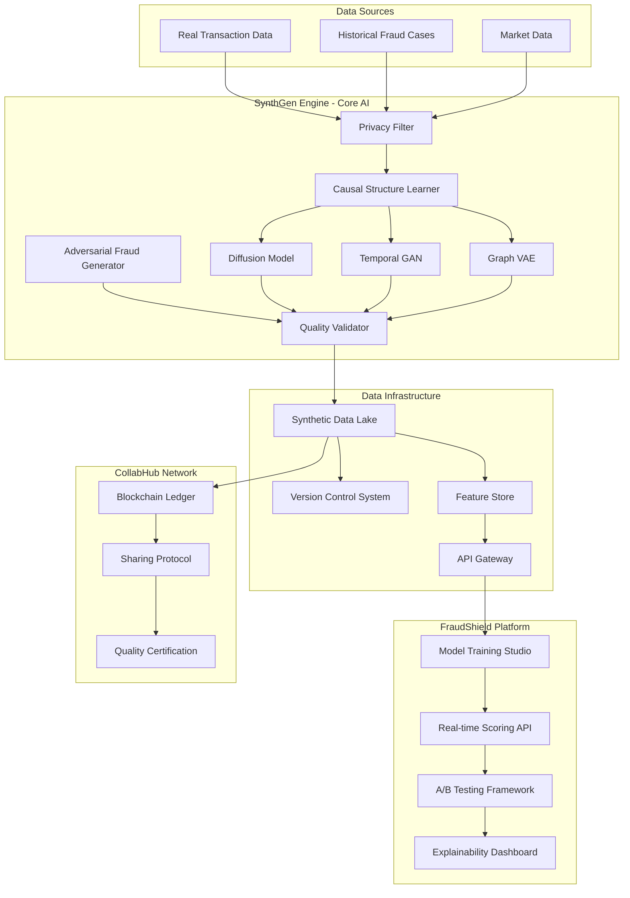
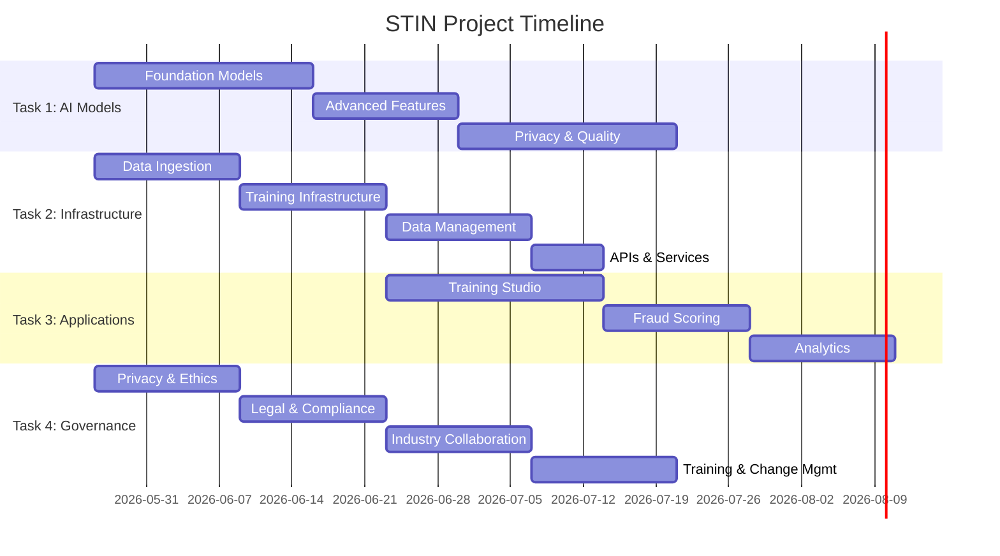
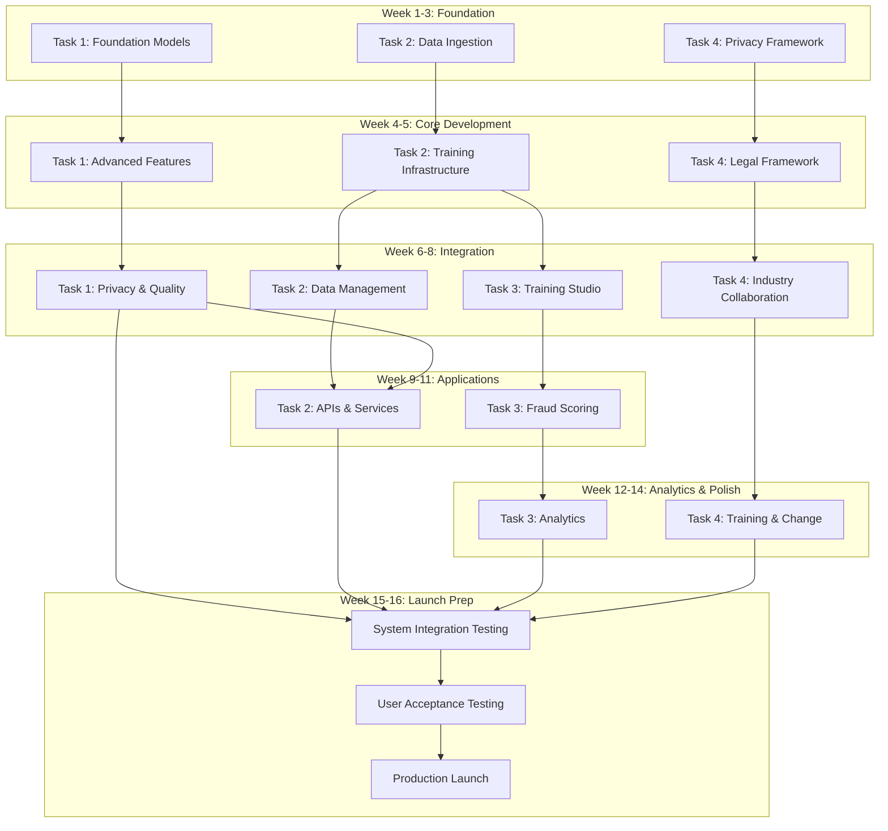

# Synthetic Transaction Intelligence Network (STIN)
## Detailed Project Plan & Task Breakdown

---

## Executive Summary

### What We're Building

**Product Name:** Synthetic Transaction Intelligence Network (STIN)

**Product Description:**
STIN is a comprehensive AI-powered platform that generates synthetic financial transaction data that is statistically indistinguishable from real data but contains zero actual customer information. The platform consists of three core products:

1. **SynthGen Engine** - The AI core that generates synthetic transactions using advanced generative models
2. **FraudShield Platform** - A fraud detection training and deployment system powered by synthetic data
3. **CollabHub** - A secure cross-institution data sharing network with blockchain-based provenance

**Core Value Proposition:**
- Financial institutions can train better fraud detection models without privacy concerns
- Banks can collaborate and share fraud intelligence through synthetic data
- Stress testing and scenario analysis at 90% lower cost
- Regulatory compliance through privacy-preserving AI

**Target Users:**
- Risk Management Teams
- Fraud Detection Analysts
- Data Scientists
- Compliance Officers
- Financial Institution Executives

---

## Product Architecture Overview

---

## Detailed Task Breakdown

### Task 1: SynthGen Engine - AI Model Development
**Owner:** Technical Team Member 1 (ML/AI Specialist)
**Duration:** 8 weeks
**Complexity:** Very High

#### Objective
Build the core generative AI models that create synthetic financial transactions with perfect privacy guarantees while maintaining statistical fidelity to real data.

#### Detailed Scope

**Phase 1: Foundation Models (Weeks 1-3)**

1. **Conditional Diffusion Model for Transaction Generation**
   - Implement DDPM (Denoising Diffusion Probabilistic Model) architecture
   - Add conditional layers for controllable attributes (amount, merchant category, time, location)
   - Train on anonymized transaction features (amount distributions, temporal patterns, merchant types)
   - Implement classifier-free guidance for better control
   - Target: Generate 10,000 transactions per second with 95% fidelity score

2. **Temporal GAN for Time-Series Coherence**
   - Design TimeGAN architecture with embedding, recovery, generator, and discriminator networks
   - Implement LSTM-based generator for maintaining temporal dependencies
   - Add attention mechanism for capturing long-range patterns (weekly, monthly cycles)
   - Train on time-series features (spending patterns, seasonality, day-of-week effects)
   - Target: Maintain temporal correlation coefficient > 0.90 with real data

3. **Graph VAE for Counterparty Networks**
   - Implement Variational Graph Auto-Encoder (VGAE) architecture
   - Design encoder to learn latent representations of transaction networks
   - Build decoder to reconstruct realistic counterparty relationships
   - Add community detection preservation constraints
   - Target: Generate networks with same clustering coefficient and degree distribution as real data

**Phase 2: Advanced Features (Weeks 4-5)**

4. **Causal Structure Learning**
   - Implement PC algorithm or NOTEARS for causal discovery from transaction data
   - Learn causal relationships (e.g., salary deposit → rent payment → utility payments)
   - Encode causal constraints into generative models
   - Validate that synthetic data preserves causal relationships
   - Target: Preserve 90% of causal edges found in real data

5. **Adversarial Fraud Pattern Generator**
   - Design reinforcement learning agent using PPO algorithm
   - Create reward function that generates novel fraud patterns
   - Implement fraud pattern library (account takeover, synthetic identity, bust-out fraud)
   - Add mutation mechanism to evolve new fraud variants
   - Target: Generate 50+ novel fraud patterns not seen in training data

**Phase 3: Privacy & Quality (Weeks 6-8)**

6. **Privacy Validation Framework**
   - Implement differential privacy metrics (epsilon, delta calculations)
   - Add k-anonymity and l-diversity checks
   - Build membership inference attack tests
   - Create attribute disclosure risk assessment
   - Target: Achieve epsilon < 1.0 for differential privacy, k > 5 for k-anonymity

7. **Fidelity Assessment System**
   - Implement statistical tests (KS test, Chi-square, Jensen-Shannon divergence)
   - Build distribution comparison visualizations
   - Create correlation matrix comparison
   - Add domain-specific metrics (transaction velocity, merchant diversity)
   - Target: Pass 95% of statistical tests at p < 0.05 significance level

#### Specific Deliverables

1. **Code Repositories**
   - `synthgen-diffusion/` - Diffusion model implementation (PyTorch)
   - `synthgen-timegan/` - Temporal GAN implementation (TensorFlow)
   - `synthgen-graphvae/` - Graph VAE implementation (PyTorch Geometric)
   - `causal-learner/` - Causal structure learning module
   - `fraud-generator/` - RL-based fraud pattern generator
   - `privacy-validator/` - Privacy metrics toolkit
   - `fidelity-assessor/` - Quality assessment framework

2. **Trained Models**
   - Diffusion model checkpoint (500M parameters)
   - TimeGAN model checkpoint (100M parameters)
   - Graph VAE model checkpoint (50M parameters)
   - Fraud generator policy network (20M parameters)

3. **Documentation**
   - Model architecture specifications (50+ pages)
   - Training procedures and hyperparameters
   - API documentation for each model
   - Privacy guarantees mathematical proofs
   - Fidelity metrics benchmark report

4. **Testing Suite**
   - Unit tests for each model component (90% coverage)
   - Integration tests for model pipeline
   - Privacy attack simulation tests
   - Performance benchmarks

#### Technical Requirements

**Languages & Frameworks:**
- Python 3.10+
- PyTorch 2.0+ (primary framework)
- TensorFlow 2.12+ (for TimeGAN)
- PyTorch Geometric (for graph models)
- NumPy, SciPy, Pandas for data processing
- Scikit-learn for statistical tests

**Compute Resources:**
- 4x NVIDIA A100 GPUs (40GB each) for training
- 256GB RAM minimum
- 2TB NVMe SSD for data storage
- Cloud compute (AWS p4d.24xlarge or equivalent)

**Key Libraries:**
- `diffusers` - Hugging Face diffusion models
- `stable-baselines3` - RL algorithms
- `networkx` - Graph algorithms
- `causalnex` - Causal inference
- `opacus` - Differential privacy

#### Success Metrics

1. **Privacy Metrics:**
   - Differential privacy: ε < 1.0, δ < 10^-5
   - k-anonymity: k ≥ 5
   - Membership inference attack accuracy < 55% (random guess = 50%)

2. **Fidelity Metrics:**
   - Statistical test pass rate > 95%
   - Jensen-Shannon divergence < 0.1
   - Correlation preservation > 0.90
   - Temporal autocorrelation preservation > 0.85

3. **Performance Metrics:**
   - Generation speed: 10,000 transactions/second
   - Model inference latency: < 100ms per batch (1000 transactions)
   - Training time: < 72 hours per model

4. **Fraud Detection Metrics:**
   - Models trained on synthetic data achieve > 90% of real-data performance
   - Novel fraud patterns detected in validation set

---

### Task 2: Data Infrastructure & MLOps Platform
**Owner:** Technical Team Member 2 (Data Engineer/MLOps Specialist)
**Duration:** 7 weeks
**Complexity:** High

#### Objective
Build the scalable infrastructure that orchestrates model training, manages synthetic data lifecycle, and provides APIs for data generation and consumption.

#### Detailed Scope

**Phase 1: Data Ingestion & Processing (Weeks 1-2)**

1. **Privacy-Preserving Data Ingestion Pipeline**
   - Build secure data ingestion from multiple sources (databases, files, APIs)
   - Implement automatic PII detection and redaction using NLP models
   - Create data anonymization layer (tokenization, generalization, perturbation)
   - Add data quality checks and validation rules
   - Build audit logging for all data access
   - Target: Process 1M transactions per hour with automatic PII removal

2. **Feature Engineering Pipeline**
   - Design feature extraction from raw transactions
   - Implement temporal features (hour, day, week, month patterns)
   - Create aggregate features (rolling averages, velocity metrics)
   - Build graph features (network centrality, community membership)
   - Add feature versioning and lineage tracking
   - Target: Generate 100+ features per transaction in < 50ms

**Phase 2: Model Training Infrastructure (Weeks 3-4)**

3. **Distributed Training Orchestration**
   - Set up Kubernetes cluster for model training
   - Implement Ray cluster for distributed training
   - Create Kubeflow pipelines for ML workflows
   - Build hyperparameter tuning with Optuna
   - Add experiment tracking with MLflow
   - Implement model checkpointing and recovery
   - Target: Support training 4 models simultaneously, auto-scaling to 16 GPUs

4. **Model Registry & Versioning**
   - Build centralized model registry with MLflow
   - Implement model versioning with semantic versioning
   - Create model metadata storage (metrics, hyperparameters, training data)
   - Add model lineage tracking
   - Build model comparison and A/B testing framework
   - Target: Track 100+ model versions with full lineage

**Phase 3: Synthetic Data Management (Weeks 5-6)**

5. **Synthetic Data Lake**
   - Design data lake architecture on S3/Azure Blob Storage
   - Implement partitioning strategy (by date, institution, data type)
   - Build data catalog with metadata management
   - Create data quality monitoring
   - Add data retention and archival policies
   - Target: Store 1B+ synthetic transactions with sub-second query times

6. **Data Versioning & Lineage System**
   - Implement DVC (Data Version Control) for dataset versioning
   - Build lineage tracking from source data → models → synthetic data
   - Create reproducibility framework (regenerate exact datasets)
   - Add dataset comparison tools
   - Build dataset registry with search capabilities
   - Target: Track 50+ dataset versions with full reproducibility

7. **Feature Store Implementation**
   - Deploy Feast or Tecton feature store
   - Implement online feature serving (low latency)
   - Build offline feature store for training
   - Create feature monitoring and drift detection
   - Add feature sharing across teams
   - Target: Serve features with < 10ms p99 latency

**Phase 4: APIs & Services (Week 7)**

8. **Synthetic Data Generation API**
   - Build FastAPI service for on-demand data generation
   - Implement request queuing and rate limiting
   - Add authentication and authorization (OAuth 2.0)
   - Create batch generation endpoints
   - Build streaming generation for real-time use cases
   - Add API documentation with OpenAPI/Swagger
   - Target: Handle 1000 requests/second, 99.9% uptime

9. **Blockchain-Based Sharing Protocol**
   - Implement Hyperledger Fabric or Ethereum private network
   - Create smart contracts for data sharing agreements
   - Build provenance tracking for shared datasets
   - Add access control and audit trails
   - Implement data quality certification on-chain
   - Target: Record all sharing transactions with immutable audit trail

10. **Monitoring & Observability**
    - Deploy Prometheus for metrics collection
    - Set up Grafana dashboards for visualization
    - Implement distributed tracing with Jaeger
    - Add log aggregation with ELK stack
    - Create alerting rules for system health
    - Build cost monitoring and optimization
    - Target: 99.9% system uptime, < 5 minute incident detection

#### Specific Deliverables

1. **Infrastructure Code**
   - `terraform/` - Infrastructure as Code for cloud resources
   - `kubernetes/` - K8s manifests for all services
   - `airflow-dags/` - Data pipeline orchestration
   - `ray-clusters/` - Distributed training configs
   - `docker/` - Container definitions for all services

2. **Pipeline Code**
   - `data-ingestion/` - Data ingestion service (Python/Go)
   - `feature-engineering/` - Feature pipeline (PySpark)
   - `model-training/` - Training orchestration (Kubeflow)
   - `data-generation/` - Synthetic data generation service
   - `blockchain-service/` - Sharing protocol implementation

3. **APIs**
   - REST API for data generation (FastAPI)
   - GraphQL API for data queries
   - gRPC API for high-performance serving
   - WebSocket API for streaming generation

4. **Databases & Storage**
   - PostgreSQL for metadata and configuration
   - Redis for caching and rate limiting
   - S3/Blob Storage for data lake
   - TimescaleDB for time-series metrics
   - Neo4j for lineage graphs

5. **Documentation**
   - Infrastructure architecture diagrams
   - API documentation (OpenAPI specs)
   - Deployment runbooks
   - Disaster recovery procedures
   - Cost optimization guide

6. **Monitoring Dashboards**
   - System health dashboard
   - Model training metrics
   - Data quality dashboard
   - Cost tracking dashboard
   - API performance dashboard

#### Technical Requirements

**Languages & Frameworks:**
- Python 3.10+ (primary)
- Go 1.20+ (performance-critical services)
- SQL (PostgreSQL, TimescaleDB)
- Bash/Shell scripting

**Infrastructure:**
- Kubernetes 1.27+
- Docker 24.0+
- Terraform 1.5+
- Apache Airflow 2.6+
- Ray 2.5+
- Kubeflow 1.7+

**Cloud Services:**
- AWS: EKS, S3, RDS, ElastiCache, CloudWatch
- Or Azure: AKS, Blob Storage, PostgreSQL, Redis Cache
- Or GCP: GKE, Cloud Storage, Cloud SQL, Memorystore

**Key Tools:**
- MLflow - Experiment tracking
- DVC - Data versioning
- Feast - Feature store
- Prometheus/Grafana - Monitoring
- Hyperledger Fabric - Blockchain

#### Success Metrics

1. **Performance:**
   - Data ingestion: 1M transactions/hour
   - Feature generation: < 50ms per transaction
   - API latency: p99 < 100ms
   - Synthetic data generation: 10K transactions/second

2. **Reliability:**
   - System uptime: 99.9%
   - Data pipeline success rate: > 99%
   - Model training success rate: > 95%

3. **Scalability:**
   - Support 1B+ synthetic transactions
   - Auto-scale to 16 GPUs for training
   - Handle 1000 API requests/second

4. **Cost Efficiency:**
   - Cloud cost < $5000/month for baseline operations
   - Cost per 1M synthetic transactions < $10

---

### Task 3: FraudShield Platform - Application Development
**Owner:** Technical Team Member 3 (Full-Stack Developer/ML Engineer)
**Duration:** 7 weeks
**Complexity:** High

#### Objective
Build the end-user applications that leverage synthetic data for fraud detection model training, real-time scoring, and business intelligence.

#### Detailed Scope

**Phase 1: Model Training Studio (Weeks 1-3)**

1. **Interactive Training Interface**
   - Build web-based model training studio (React/Next.js)
   - Create drag-and-drop feature selection interface
   - Implement visual model configuration (hyperparameters, architecture)
   - Add dataset selection and preview
   - Build training job submission and monitoring
   - Create experiment comparison views
   - Target: Enable non-ML experts to train models in < 30 minutes

2. **AutoML Pipeline**
   - Implement automated feature engineering with Featuretools
   - Build automated model selection (XGBoost, LightGBM, Neural Networks, Random Forest)
   - Create hyperparameter optimization with Optuna
   - Add ensemble model creation
   - Implement automated model evaluation
   - Target: Achieve 90% of expert-tuned model performance automatically

3. **Model Training Backend**
   - Build training orchestration service (Python/FastAPI)
   - Implement distributed training for large datasets
   - Create model evaluation pipeline
   - Add cross-validation and holdout testing
   - Build model performance tracking
   - Implement early stopping and checkpointing
   - Target: Train models on 100M+ transactions in < 2 hours

**Phase 2: Real-Time Fraud Scoring (Weeks 4-5)**

4. **Fraud Scoring API**
   - Build high-performance scoring API (FastAPI/Go)
   - Implement model serving with TensorFlow Serving or TorchServe
   - Create batch scoring endpoints
   - Add real-time streaming scoring (Kafka integration)
   - Implement model versioning and A/B testing
   - Add request/response logging
   - Target: Score 10,000 transactions/second with < 50ms latency

5. **A/B Testing Framework**
   - Build experiment management system
   - Implement traffic splitting for model variants
   - Create statistical significance testing
   - Add automated winner selection
   - Build experiment analytics dashboard
   - Target: Run 10+ concurrent experiments with automatic analysis

6. **Decision Engine**
   - Implement rule-based decision layer on top of ML scores
   - Create configurable thresholds and actions
   - Build decision workflow (approve, review, decline)
   - Add override capabilities for manual review
   - Implement decision audit trail
   - Target: Process decisions in < 10ms after scoring

**Phase 3: Analytics & Explainability (Weeks 6-7)**

7. **Explainability Dashboard**
   - Implement SHAP (SHapley Additive exPlanations) for model interpretability
   - Build LIME (Local Interpretable Model-agnostic Explanations) integration
   - Create feature importance visualizations
   - Add individual prediction explanations
   - Build counterfactual explanation generator
   - Implement attention visualization for neural networks
   - Target: Generate explanations in < 500ms per prediction

8. **Performance Analytics**
   - Build real-time performance monitoring dashboard
   - Create confusion matrix and ROC curve visualizations
   - Implement precision-recall analysis
   - Add false positive/negative investigation tools
   - Build model drift detection
   - Create business impact metrics ($ saved, fraud caught)
   - Target: Update dashboards in real-time (< 1 second latency)

9. **Fraud Pattern Explorer**
   - Build interactive fraud pattern visualization
   - Create clustering visualization for fraud types
   - Implement temporal pattern analysis
   - Add network visualization for fraud rings
   - Build anomaly detection dashboard
   - Target: Identify new fraud patterns within 24 hours of emergence

**Phase 4: Integration & Deployment (Week 7)**

10. **Regulatory Reporting Module**
    - Build automated report generation
    - Create compliance documentation templates
    - Implement model validation reports
    - Add audit trail reports
    - Build regulatory submission package generator
    - Target: Generate complete compliance package in < 1 hour

11. **Stress Testing Simulator**
    - Build scenario generation interface
    - Implement Monte Carlo simulation engine
    - Create stress test report generator
    - Add what-if analysis tools
    - Build portfolio impact calculator
    - Target: Run 10,000 scenarios in < 5 minutes

#### Specific Deliverables

1. **Frontend Applications**
   - `training-studio/` - React/Next.js web application
   - `fraud-dashboard/` - Real-time monitoring dashboard
   - `analytics-portal/` - Business intelligence interface
   - `admin-console/` - System administration interface

2. **Backend Services**
   - `training-service/` - Model training orchestration (Python/FastAPI)
   - `scoring-service/` - Real-time fraud scoring (Go/FastAPI)
   - `decision-engine/` - Decision workflow service
   - `analytics-service/` - Analytics computation service
   - `reporting-service/` - Report generation service

3. **ML Components**
   - `automl-pipeline/` - Automated ML pipeline
   - `explainability-engine/` - SHAP/LIME implementation
   - `drift-detector/` - Model drift detection
   - `ensemble-builder/` - Model ensemble creation

4. **Databases**
   - PostgreSQL for application data
   - ClickHouse for analytics (time-series)
   - Redis for caching and session management
   - Elasticsearch for log search

5. **Documentation**
   - User guides for each application (100+ pages)
   - API documentation
   - Model training best practices
   - Fraud detection playbook
   - Troubleshooting guide

6. **Testing Suite**
   - Unit tests (90% coverage)
   - Integration tests
   - End-to-end tests (Playwright/Cypress)
   - Load tests (k6/Locust)
   - Security tests (OWASP)

#### Technical Requirements

**Frontend:**
- React 18+ with TypeScript
- Next.js 13+ for SSR
- TailwindCSS for styling
- D3.js/Plotly for visualizations
- WebSocket for real-time updates

**Backend:**
- Python 3.10+ with FastAPI
- Go 1.20+ for performance-critical services
- Celery for async task processing
- Redis for caching
- PostgreSQL 15+

**ML Frameworks:**
- Scikit-learn for classical ML
- XGBoost/LightGBM for gradient boosting
- PyTorch for neural networks
- SHAP for explainability
- Featuretools for feature engineering

**Infrastructure:**
- Docker for containerization
- Kubernetes for orchestration
- Nginx for load balancing
- Kafka for event streaming

#### Success Metrics

1. **User Experience:**
   - Model training time: < 30 minutes for non-experts
   - Dashboard load time: < 2 seconds
   - User satisfaction score: > 4.5/5

2. **Performance:**
   - Scoring latency: p99 < 50ms
   - Dashboard update latency: < 1 second
   - Concurrent users supported: 1000+

3. **Model Performance:**
   - Fraud detection rate: > 95%
   - False positive rate: < 2%
   - Models trained on synthetic data achieve > 90% of real-data performance

4. **Business Impact:**
   - Fraud losses reduced by 40%
   - Manual review workload reduced by 50%
   - Time to deploy new models: < 1 day

---

### Task 4: Governance, Ethics & Industry Collaboration
**Owner:** Non-Technical Team Member (Strategy/Compliance Lead)
**Duration:** 8 weeks (parallel with technical tasks)
**Complexity:** High

#### Objective
Establish the ethical, legal, and governance framework for synthetic data usage, create industry collaboration mechanisms, and ensure regulatory compliance.

#### Detailed Scope

**Phase 1: Privacy & Ethics Framework (Weeks 1-2)**

1. **Privacy Framework Development**
   - Research and document privacy regulations (GDPR, CCPA, PIPEDA, etc.)
   - Create privacy impact assessment template
   - Develop data minimization guidelines
   - Write consent and disclosure policies
   - Create privacy breach response procedures
   - Define data retention and deletion policies
   - Target: Comprehensive 50+ page privacy framework document

2. **Ethics Guidelines**
   - Establish AI ethics principles for synthetic data
   - Create fairness and bias assessment framework
   - Develop transparency and explainability standards
   - Write guidelines for responsible AI use
   - Create ethics review board charter
   - Define prohibited use cases
   - Target: Ethics framework aligned with IEEE and EU AI Act standards

3. **Risk Assessment**
   - Identify potential misuse scenarios
   - Assess re-identification risks
   - Evaluate model inversion attack risks
   - Document mitigation strategies
   - Create risk monitoring procedures
   - Target: Complete risk register with mitigation plans

**Phase 2: Legal & Compliance (Weeks 3-4)**

4. **Legal Framework for Data Sharing**
   - Draft data sharing agreements template
   - Create intellectual property rights documentation
   - Develop liability and indemnification clauses
   - Write terms of service and acceptable use policy
   - Create licensing models (open source, commercial, enterprise)
   - Develop dispute resolution procedures
   - Target: Legally vetted agreements ready for execution

5. **Regulatory Compliance Documentation**
   - Map requirements for financial regulations (SEC, FINRA, OCC, FDIC)
   - Create compliance checklists
   - Develop model validation documentation
   - Write audit trail specifications
   - Create regulatory reporting templates
   - Document model governance procedures
   - Target: Complete compliance package for regulatory submission

6. **Data Governance Model**
   - Define data ownership and stewardship roles
   - Create data classification scheme
   - Develop access control policies
   - Write data quality standards
   - Create metadata management procedures
   - Define data lifecycle management
   - Target: Comprehensive data governance framework

**Phase 3: Industry Collaboration (Weeks 5-6)**

7. **Industry Consortium Development**
   - Research existing consortiums and best practices
   - Draft consortium charter and bylaws
   - Define membership tiers and benefits
   - Create governance structure (board, committees)
   - Develop funding model
   - Write collaboration protocols
   - Identify founding member institutions
   - Target: Launch consortium with 5+ founding members

8. **Synthetic Data Quality Standards**
   - Define quality metrics and benchmarks
   - Create certification criteria
   - Develop testing procedures
   - Write quality assurance guidelines
   - Create quality seal/badge program
   - Define recertification requirements
   - Target: Industry-recognized quality standard

9. **Knowledge Sharing Platform**
   - Design community portal structure
   - Create best practices repository
   - Develop case study template
   - Write contribution guidelines
   - Create discussion forum structure
   - Define content moderation policies
   - Target: Active community with 100+ members in first year

**Phase 4: Training & Change Management (Weeks 7-8)**

10. **Training Program Development**
    - Create role-based training curricula
      - Data Scientists: 20 hours (model training, evaluation)
      - Fraud Analysts: 16 hours (using FraudShield platform)
      - Compliance Officers: 12 hours (governance, reporting)
      - Executives: 4 hours (strategic overview)
    - Develop hands-on labs and exercises
    - Create certification exams
    - Write training materials (slides, videos, documentation)
    - Build learning management system
    - Target: Certify 50+ users in first 3 months

11. **Change Management Strategy**
    - Conduct stakeholder analysis
    - Create communication plan
    - Develop adoption roadmap
    - Write executive briefing materials
    - Create success metrics and KPIs
    - Design feedback collection mechanisms
    - Plan pilot program with early adopters
    - Target: 80% user adoption within 6 months

12. **Business Case & ROI Framework**
    - Develop ROI calculation methodology
    - Create cost-benefit analysis template
    - Write business case template
    - Develop success metrics framework
    - Create benchmarking methodology
    - Design value realization tracking
    - Target: Demonstrate 300% ROI within 18 months

**Phase 5: Documentation & Communication (Ongoing)**

13. **Comprehensive Documentation**
    - Write executive summary (5 pages)
    - Create technical white paper (30 pages)
    - Develop user guides (100+ pages)
    - Write API documentation
    - Create FAQ document (50+ questions)
    - Develop troubleshooting guide
    - Target: Complete documentation library

14. **Marketing & Communication Materials**
    - Create product brochures
    - Develop case studies (5+ examples)
    - Write blog posts and articles
    - Create demo videos
    - Develop presentation decks
    - Design infographics
    - Target: Comprehensive marketing kit

15. **Regulatory Engagement**
    - Identify key regulatory contacts
    - Schedule regulatory briefings
    - Prepare regulatory submissions
    - Respond to regulatory inquiries
    - Participate in industry working groups
    - Target: Positive regulatory feedback and approval

#### Specific Deliverables

1. **Policy Documents**
   - Privacy Framework (50+ pages)
   - Ethics Guidelines (30+ pages)
   - Data Governance Model (40+ pages)
   - Legal Agreements Template Library (20+ documents)
   - Compliance Documentation Package (100+ pages)

2. **Governance Structures**
   - Industry Consortium Charter
   - Ethics Review Board Charter
   - Data Governance Committee Charter
   - Quality Certification Standards

3. **Training Materials**
   - Training Curriculum (4 role-based tracks)
   - Training Videos (20+ hours)
   - Hands-on Lab Exercises (15+ labs)
   - Certification Exams (4 exams)
   - Quick Reference Guides (10+ guides)

4. **Business Documents**
   - Business Case Template
   - ROI Calculator
   - Cost-Benefit Analysis Framework
   - Success Metrics Dashboard
   - Benchmarking Methodology

5. **Communication Materials**
   - Executive Summary
   - Technical White Paper
   - User Guides (5+ guides)
   - Case Studies (5+ studies)
   - Marketing Brochures
   - Demo Videos (10+ videos)
   - Presentation Decks (5+ decks)

6. **Regulatory Submissions**
   - Model Validation Documentation
   - Privacy Impact Assessment
   - Compliance Attestations
   - Audit Reports
   - Regulatory Briefing Materials

#### Success Metrics

1. **Compliance:**
   - Zero privacy breaches
   - 100% regulatory compliance
   - Pass all audits on first attempt

2. **Adoption:**
   - 5+ founding consortium members
   - 50+ certified users in 3 months
   - 80% user adoption in 6 months

3. **Business Impact:**
   - 300% ROI within 18 months
   - 5+ customer case studies
   - Industry recognition (awards, publications)

4. **Community:**
   - 100+ community members in year 1
   - 20+ contributed best practices
   - 10+ published case studies

---

## Project Timeline & Dependencies

### Timeline Overview (16 weeks total)

### Detailed Dependency Map

### Critical Path Analysis

**Critical Path:** Task 1 → Task 2 (APIs) → Task 3 (Applications) → Integration → Launch

**Critical Dependencies:**

1. **Week 1-3:** Task 1 (Foundation Models) must complete before Task 2 (Training Infrastructure) can fully function
2. **Week 4-5:** Task 1 (Advanced Features) needed for Task 2 (Data Management) to implement quality checks
3. **Week 6-8:** Task 2 (Training Infrastructure) must be ready before Task 3 (Training Studio) can be built
4. **Week 9-11:** Task 1 (Privacy & Quality) must complete before Task 2 (APIs) can be production-ready
5. **Week 12-14:** Task 2 (APIs) must be ready before Task 3 (Fraud Scoring) can integrate

**Parallel Work Opportunities:**

- Task 4 (Governance) runs completely in parallel with minimal dependencies
- Task 2 (Data Ingestion) can start immediately alongside Task 1
- Task 3 (Frontend) can start UI/UX design while waiting for backend APIs

### Weekly Milestone Schedule

**Week 1-2:**
- ✓ Task 1: Diffusion model architecture complete
- ✓ Task 2: Data ingestion pipeline operational
- ✓ Task 4: Privacy framework draft complete

**Week 3-4:**
- ✓ Task 1: TimeGAN and Graph VAE trained
- ✓ Task 2: Training infrastructure deployed
- ✓ Task 4: Legal agreements drafted

**Week 5-6:**
- ✓ Task 1: Causal learning implemented
- ✓ Task 2: Data lake and versioning operational
- ✓ Task 4: Consortium charter finalized

**Week 7-8:**
- ✓ Task 1: Privacy validation complete
- ✓ Task 2: Feature store deployed
- ✓ Task 3: Training studio beta ready
- ✓ Task 4: Quality standards published

**Week 9-10:**
- ✓ Task 2: APIs production-ready
- ✓ Task 3: Fraud scoring API deployed

**Week 11-12:**
- ✓ Task 3: A/B testing framework operational
- ✓ Task 4: Training program launched

**Week 13-14:**
- ✓ Task 3: Analytics dashboard complete
- ✓ Task 4: Change management rollout

**Week 15:**
- ✓ System integration testing complete
- ✓ User acceptance testing passed

**Week 16:**
- ✓ Production launch
- ✓ Initial customer onboarding

---

## Risk Management

### Technical Risks

| Risk | Impact | Probability | Mitigation |
|------|--------|-------------|------------|
| Model training takes longer than expected | High | Medium | Start with smaller models, use pre-trained weights, add more compute |
| Synthetic data quality insufficient | High | Medium | Implement rigorous testing early, have fallback to simpler models |
| Infrastructure scaling issues | Medium | Low | Use managed services, implement auto-scaling, load test early |
| API performance bottlenecks | Medium | Medium | Implement caching, use CDN, optimize database queries |

### Business Risks

| Risk | Impact | Probability | Mitigation |
|------|--------|-------------|------------|
| Regulatory concerns about synthetic data | High | Medium | Early regulatory engagement, comprehensive documentation |
| Low industry adoption | High | Low | Focus on clear ROI, build strong case studies, offer free trials |
| Privacy breach or attack | Very High | Low | Multiple security layers, regular audits, insurance |
| Competitor launches similar product | Medium | Medium | Focus on quality and community, build strong partnerships |

### Mitigation Strategies

1. **Weekly Risk Reviews:** Team reviews risks every Friday
2. **Early Testing:** Begin integration testing in Week 10
3. **Regulatory Engagement:** Start conversations in Week 4
4. **Backup Plans:** Have simpler model architectures ready
5. **Buffer Time:** 2-week buffer built into timeline

---

## Success Criteria

### Technical Success Criteria

1. **Model Performance:**
   - ✓ Synthetic data passes 95% of statistical tests
   - ✓ Privacy metrics meet targets (ε < 1.0, k ≥ 5)
   - ✓ Generation speed: 10K transactions/second
   - ✓ Fraud models trained on synthetic data achieve > 90% of real-data performance

2. **Infrastructure Performance:**
   - ✓ System uptime: 99.9%
   - ✓ API latency: p99 < 100ms
   - ✓ Support 1B+ synthetic transactions
   - ✓ Cost per 1M transactions < $10

3. **Application Performance:**
   - ✓ Fraud detection rate: > 95%
   - ✓ False positive rate: < 2%
   - ✓ Dashboard load time: < 2 seconds
   - ✓ Support 1000+ concurrent users

### Business Success Criteria

1. **Adoption Metrics:**
   - ✓ 5+ founding consortium members
   - ✓ 50+ certified users in 3 months
   - ✓ 80% user adoption in 6 months
   - ✓ 10+ customer deployments in year 1

2. **Financial Metrics:**
   - ✓ 300% ROI within 18 months
   - ✓ 40% reduction in fraud losses
   - ✓ 50% reduction in manual review workload
   - ✓ Revenue target: $5M ARR in year 2

3. **Industry Impact:**
   - ✓ Published in 2+ academic conferences
   - ✓ Featured in 5+ industry publications
   - ✓ Win 1+ industry awards
   - ✓ Establish industry standard for synthetic data quality

---

## Next Steps

### Immediate Actions (Week 0 - Pre-Kickoff)

1. **Team Assembly:**
   - Confirm team member assignments
   - Schedule kickoff meeting
   - Set up communication channels (Slack, email lists)

2. **Environment Setup:**
   - Provision cloud accounts (AWS/Azure/GCP)
   - Set up development environments
   - Create GitHub repositories
   - Configure CI/CD pipelines

3. **Planning:**
   - Review and approve this project plan
   - Identify any gaps or concerns
   - Adjust timeline if needed
   - Set up project management tools (Jira, Linear)

4. **Stakeholder Alignment:**
   - Present plan to leadership
   - Get budget approval
   - Identify pilot customers
   - Schedule regulatory briefings

### Week 1 Kickoff Activities

1. **Monday:** Full team kickoff meeting
2. **Tuesday:** Individual task deep-dives
3. **Wednesday:** Set up development environments
4. **Thursday:** Begin Week 1 deliverables
5. **Friday:** First weekly sync and risk review

---

## Appendix

### Glossary of Terms

- **Differential Privacy:** Mathematical framework for privacy guarantees
- **GAN:** Generative Adversarial Network
- **VAE:** Variational Autoencoder
- **SHAP:** SHapley Additive exPlanations
- **MLOps:** Machine Learning Operations
- **Feature Store:** Centralized repository for ML features

### Technology Stack Summary

**AI/ML:**
- PyTorch, TensorFlow, Scikit-learn
- Hugging Face Transformers
- Ray, Kubeflow

**Infrastructure:**
- Kubernetes, Docker, Terraform
- Apache Kafka, Airflow
- PostgreSQL, Redis, S3

**Applications:**
- React, Next.js, TypeScript
- FastAPI, Go
- D3.js, Plotly

**Monitoring:**
- Prometheus, Grafana
- ELK Stack, Jaeger

### Reference Architecture Diagram

See detailed architecture diagram in Project Architecture Overview section above.

### Contact Information

- **Project Lead:** [To be assigned]
- **Technical Lead (Task 1):** [To be assigned]
- **Infrastructure Lead (Task 2):** [To be assigned]
- **Application Lead (Task 3):** [To be assigned]
- **Governance Lead (Task 4):** [To be assigned]

---

*Document Version: 1.0*
*Last Updated: 2026-05-20*
*Next Review: Week 4 (2026-06-16)*